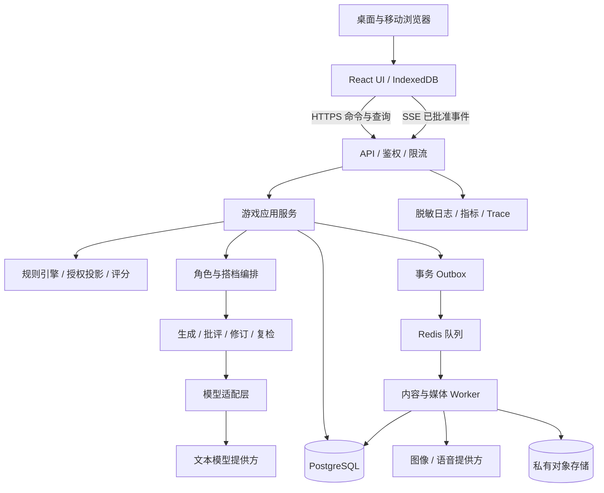

# AI 剧本杀游戏技术与实施方案

| 项目 | 内容 |
|---|---|
| 文档版本 | V1.1 · 当前实现与演进方案 |
| 编制日期 | 2026-09-14 |
| 需求依据 | 用户提供的《AI剧本杀游戏产品需求文档-精细版.md》，PRD V1.1.0 |
| 产品边界 | 单人 AI 互动推理；无多人联机、好友、私聊、社区、排行榜 |
| 交付范围 | 技术架构、模块设计、数据与内容协议、交互、质量保障、实施计划 |
| 状态说明 | 已补充当前 MVP 实现基线；未标注“已实现”的内容仍属于演进方案或待实测目标 |

## 1. 方案摘要

当前 MVP 已采用 **响应式 React/Vite PWA 前端 + FastAPI 模块化单体 + SQLAlchemy + SQLite + 进程内异步对话任务**，支持桌面和手机浏览器。PostgreSQL、Redis/Worker、对象存储和原生移动 App 是生产演进方向；完全离线推理和视频角色暂不在范围内。

游戏的真相、角色知识权限、证物解锁、事件推进、评分和结局由服务端确定性规则控制；大语言模型负责有边界的角色表达、辅助分析和创作建议。每个角色拥有独立状态与上下文，但不需要为每个角色部署独立服务或常驻进程。

对话采用“候选生成 → 批评检测 → 修订与复检 → 审核通过后交付”。未审核草稿不得进入浏览器、语音服务或普通日志。MVP 将完整审核后的回答分段传输和渐进显示，并明确其与原始模型实时 token 流的区别。真正按语义块审核放行的流式方案在后续阶段验证。

以至少 3 个可完成的预设剧本验证完整闭环。先建设规则引擎、信息隔离和存档一致性，再接入模型和界面，避免由自由生成对白临时决定游戏规则。

### 1.1 关键决策

| 事项 | 建议决策 | 原因及约束 |
|---|---|---|
| 首发平台 | 响应式 Web，PWA 提供安装入口与有限离线能力 | 一套界面覆盖桌面与手机；不承诺离线 AI 调查 |
| 服务形态 | 模块化单体，耗时任务独立 Worker | 简化事务、调试和部署；为未来拆分保留模块边界 |
| 权威数据 | 服务端 PostgreSQL | 浏览器无法直接修改真相、证物和结局 |
| 角色实现 | 按会话与角色隔离的智能体实例状态 | 人格和记忆独立，模型连接池共用 |
| 剧情推进 | 类型化条件表达式与事件引擎 | 可重放、可测试，禁止任意脚本执行 |
| 对话传输 | HTTP 命令 + SSE 事件流 | 单向生成进度无需 WebSocket；网络恢复有明确游标 |
| 真相保护 | 最小上下文、输出审核、接口字段白名单 | 单靠提示词无法可靠隔离秘密 |
| 正确性判定 | 结构化标准答案与证据链评分 | LLM 点评不改写标准答案或最终分数 |
| 内容发布 | 私人剧本版本启用 / 官方内容内部发布 | 不建设公开投稿社区或社交系统 |

### 1.2 需求冲突与处理建议

| PRD 表述 | 技术处理 | 评审事项 |
|---|---|---|
| 首 token ≤ 2 秒，同时三层审核 | 分开统计模型原始 TTFT 与审核后首条可见正文延迟；状态反馈不计为正文 | 原始 TTFT 2 秒作为目标，可见正文暂定 P95 ≤ 12 秒；不能假称同时达成 |
| 角色不会泄露谜底 | 采用权限约束与评测门槛，不宣称对所有自然语言攻击绝对保证 | 冻结攻击集、漏检与误拦截指标 |
| 中断并保存已完成文本 | 保存已交付的完整语义块；未交付草稿丢弃 | 玩家已解锁的线索不可因停止显示而撤销 |
| 断网行动暂存 | 离线笔记可编辑；调查意图排队，联网后重新校验 | 不在离线状态虚构调查成功或证物解锁 |
| 冲突保留最新事件序列 | 使用服务器序号和乐观锁，禁止按设备时间覆盖 | 过期命令返回冲突，保留笔记冲突副本 |
| 角色知道秘密但模型最小授权 | 区分“角色知道”和“当前允许说”；核心答案尽量转换为回避策略 | 少量必须使用私密背景的角色调用属于独立风险等级 |
| 多模型与多种媒体 | MVP 接入两个文本提供方；媒体逐步扩展 | 模型具体 ID、配额、地区可用性部署时验证 |

## 2. 技术基线

### 2.1 建议技术栈

下表是生产演进建议；当前 MVP 的实际运行基线见第 19 节，实施时不得把建议栈误写成已部署组件。

| 层级 | 技术建议 | 职责 |
|---|---|---|
| 语言与运行时 | TypeScript 严格模式；Node.js 24 LTS；pnpm workspace | 前后端共享协议和规则类型 |
| 前端 | React 19、Vite 稳定版 | 剧本库、调查界面、编辑器 |
| 路由与状态 | React Router、TanStack Query、Zustand | 路由、服务端缓存、临时界面状态分别管理 |
| 样式与无障碍 | CSS Variables、CSS Modules、Radix primitives | 统一主题、焦点、弹窗、键盘交互 |
| 图形编辑 | React Flow，V1.5 引入 | 剧情图、角色关系、证据关联 |
| 本地存储 | IndexedDB + Dexie | 笔记草稿、已知内容快照、待同步意图 |
| API 服务 | Fastify + JSON Schema / TypeBox | 身份校验、命令处理、查询与 SSE |
| 主数据库 | PostgreSQL 17、Drizzle ORM 与受审查 SQL 迁移 | 事务、存档、内容版本、权限与审计 |
| 队列与限流 | Redis 7、BullMQ | 异步生成、重试、并发限制；不作为唯一存档 |
| 文件存储 | S3 兼容对象存储，私有桶与短时签名 URL | 封面、立绘、证物与音频 |
| 模型层 | 自有 Provider Adapter + 官方 SDK / HTTP 客户端 | 统一能力协商、错误和使用量计量 |
| 测试 | Vitest、Playwright、真实 PostgreSQL/Redis 集成环境、k6 | 单元、接口、端到端、压测与 AI 评测 |
| 观测 | OpenTelemetry、结构化 JSON 日志 | 请求、队列、模型链路与成本关联 |
| 部署 | Docker；开发 Docker Compose；生产托管数据库与容器 | 环境隔离与可重复部署 |

MVP 不引入微服务集群、向量数据库和通用智能体自治框架。单局数据首先按角色、阶段和事实 ID 精确检索；只有检索质量和规模证明必要时才增加向量索引，且必须先按权限过滤。

### 2.2 环境基线

- 开发、测试、预发布、生产使用独立数据库、对象桶和密钥。
- `.env.example` 只列变量名和示例占位值；真实凭证由密钥管理服务注入。
- 所有环境启动时校验配置 Schema；必需字段缺失时明确报错，禁止静默切换到生产资源。
- CI 固定 Node、包管理器、锁文件和迁移版本；禁止运行时自动升级依赖。
- 本地通过模拟 Provider 完成无密钥开发；真实模型调用使用专用测试预算。

## 3. 技术原则

1. **规则先于生成。** LLM 提交候选表达或操作建议，不能直接修改存档、发放证物或判定结局。
2. **最小信息授权。** 角色、搭档、推荐问题、图片生成等任务分别构造上下文，不共享完整剧本提示词。
3. **事实与陈述分离。** 客观事实、角色谎言、角色错误认知和玩家推测保留不同类型与来源。
4. **审核后交付。** 草稿未通过审核时不向玩家发送，包括字幕、语音、标题和图片说明。
5. **服务端权威。** 前端隐藏只是体验处理，实际权限在查询、资源下载和状态变更时再次校验。
6. **副作用可重放。** 关键命令具有幂等键、版本号和可审计结果；模型再次调用不保证得到相同文本。
7. **内容版本固定。** 进行中的游戏绑定不可变剧本版本；编辑新版本不污染旧存档。
8. **失败有明确状态。** 超时、拒绝、取消、冲突、余额不足分别处理，不伪装成角色台词。
9. **隐私默认最少。** 普通日志不记录对话全文、笔记、音频、秘密设定或密钥。
10. **先验证再扩展。** 先以三本闭环和故障测试验证系统，后加入编辑器与动态生成。

## 4. 总体架构



### 4.1 模块边界

| 模块 | 输入 / 输出 | 关键责任 |
|---|---|---|
| identity | 登录、游客令牌 → 用户身份 | 所有权、游客迁移、会话撤销 |
| content | 草稿 → 校验后的不可变内容版本 | 内部发布、导入导出、资源引用 |
| game | 行动命令 → 事件与玩家状态 | 调查、行动点、时间推进、存档 |
| policy | 主体、资源、阶段 → 可见投影 | 权限统一入口，默认拒绝 |
| agents | 问题、授权上下文 → 候选回答 | 人格、记忆、承诺陈述与调用预算 |
| guard | 候选、披露策略 → 通过/修订/拒绝 | 结构、秘密、时序、一致性审核 |
| partner | 已知证据、授权笔记 → 引用式分析 | 不读取答案库，不自动覆盖笔记 |
| evidence | 发现/分析/组合/出示 → 状态事件 | 前置条件与角色反应触发 |
| settlement | 推理提交 → 分数、结局、复盘 | 确定性答案比对与真相授权 |
| media | 生成任务 → 受审查资产版本 | 异步、取消、配额、结果替换 |
| operations | Trace、计量、故障码 → 运维视图 | 不提供普通用户查看系统真相的入口 |

### 4.2 单人会话与并发

一局只属于一个真实玩家，但同一玩家可能多标签页或多设备打开。同一 `session_id` 同时只允许一个改变调查状态的命令执行；笔记编辑采用独立版本，避免长对话阻塞记录。模型调用期间不持有数据库长事务：先预留运行槽，生成后检查 `base_state_version` 再提交。

异步摘要与媒体任务只引用明确版本。若会话版本变化使候选回答失效，重新授权后决定重检或废弃，不能直接提交旧回答。后台任务采用至少一次投递，通过数据库唯一约束避免重复效果，不宣称队列天然“恰好一次”。

## 5. 建议目录结构

项目采用 **Python FastAPI 后端 + React TypeScript 前端 + PostgreSQL**。目录以当前实际工程组织为准，后端模块保持清晰的功能边界，前端按页面、组件、状态和接口分层。

```text
ai-mystery/
├── api/                          # 后端（Python FastAPI）
│   ├── main.py                   # 主应用入口、路由注册、中间件
│   ├── settings.py               # 配置管理（LLM 服务、模型选择、环境变量）
│   ├── llm_service.py            # AI 三阶段处理：生成 → 批评 → 修订
│   ├── invoke_types.py           # Pydantic 请求、响应和流式事件模型
│   ├── models.py                 # SQLAlchemy ORM 模型
│   ├── evidence_models.py        # 证物系统数据模型
│   ├── db.py                     # PostgreSQL 连接池、Session 和事务
│   ├── scripts_api.py            # 剧本库、剧本版本和自定义剧本 API
│   ├── evidence_api.py           # 证物发现、分析、组合、出示 API
│   ├── database_api.py           # 通用数据库查询与存档操作 API
│   ├── spoiler_story_api.py      # 剧透故事、结算和真相揭示 API
│   ├── avatar_generator.py       # 角色头像生成任务
│   ├── cover_generator.py        # 剧本封面生成任务
│   ├── background_generator.py   # 聊天背景生成任务
│   ├── evidence_generator.py     # 证物图像生成任务
│   ├── schema.sql                # PostgreSQL 初始化结构和索引
│   ├── requirements.txt          # Python 依赖锁定清单
│   ├── Dockerfile                # 后端容器配置
│   └── .env.example              # 环境变量模板（不含真实密钥）
│
├── web/                          # 前端（React + TypeScript）
│   ├── src/
│   │   ├── pages/                # 页面组件
│   │   │   ├── Home.tsx          # 主游戏界面
│   │   │   ├── ScriptLibrary.tsx # 剧本库
│   │   │   ├── ScriptEditor.tsx  # 可视化剧本编辑器
│   │   │   ├── ScriptGenerator.tsx # AI 剧本生成
│   │   │   ├── PlayScript.tsx    # 剧本游玩、调查和流式对话
│   │   │   └── DocsPage.tsx      # 产品与使用文档页面
│   │   ├── components/           # UI 组件
│   │   │   ├── Actor.tsx          # 角色对话和状态展示
│   │   │   ├── EnhancedNotesPanel.tsx # 推理笔记面板
│   │   │   ├── MultipleChoiceGame.tsx # 推理结算答题
│   │   │   ├── evidence/          # 证物查看、组合、出示组件
│   │   │   ├── notes/             # 笔记、时间线和关系图组件
│   │   │   ├── ScriptEditor/      # 编辑器画布、节点和属性面板
│   │   │   └── ScriptGenerator/   # AI 生成、预览和质检组件
│   │   ├── providers/             # React Context 和全局状态
│   │   ├── api/                   # REST、SSE 和生成任务调用层
│   │   ├── types/                 # TypeScript 类型定义
│   │   └── utils/                 # 格式化、校验、缓存和工具函数
│   ├── public/                   # 静态资源
│   │   ├── character_avatars/     # 角色头像
│   │   ├── script_covers/         # 剧本封面
│   │   ├── script_scenes/         # 场景背景
│   │   └── evidence_images/       # 证物图像
│   ├── package.json              # 前端依赖和脚本
│   └── Dockerfile                # 前端构建与静态服务容器
│
├── docs/                         # 项目文档、接口说明和架构决策记录
├── data/                         # 开发用剧本、种子数据和测试素材
├── Makefile                      # 开发、测试、迁移和容器命令
└── README.md                     # 项目说明、启动方式和部署指南
```

### 5.1 目录职责与约束

- `api/` 是服务端权威边界；真相、角色私密信息、评分标准和未解锁证物不得进入 `web/public/` 或前端构建产物。
- `llm_service.py` 只负责模型编排和三阶段文本处理；状态变更、证物发放和结局判定由 API/数据库事务完成。
- 四个内容生成器统一返回任务 ID 和审核状态；生成图片通过受控目录或对象存储引用，不把用户输入直接拼接为文件路径。
- `invoke_types.py` 的 Pydantic 模型作为前后端接口契约；流式事件至少包含 `run_id`、序号、状态和已审核文本块。
- `models.py`、`evidence_models.py` 与 `schema.sql` 必须保持迁移同步；生产环境禁止手工改表。
- `web/src/api/` 不得缓存未授权内容；`providers/` 管理当前会话、流式连接、笔记草稿和错误状态。
- `data/` 仅放合成数据和已授权开发素材；正式剧本源文件及答案由后端部署流程注入并按版本冻结。
- 项目不包含多人联机、社交、好友、私聊和社区模块。

### 5.2 建议后续演进

当 API 模块规模扩大时，可在不改变外部目录的前提下增加 `api/services/`、`api/repositories/`、`api/routers/` 和 `api/workers/` 子目录。当前阶段不强制拆分，先保持现有文件可运行并通过测试。
## 6. 核心数据模型

### 6.1 内容数据

| 实体 | 关键字段 | 关系与约束 |
|---|---|---|
| Script | id、owner_id、title、status | 官方剧本与私人剧本区分所有权 |
| ScriptVersion | id、script_id、version、schema_version、checksum、status | 启用后不可变，含配置与答案引用 |
| Chapter / Scene | id、version_id、order、entry_condition | 地点、章节和可调查对象引用版本内 ID |
| Character | id、version_id、role_type、persona、speech_style | `role_type` 的真凶标记只在服务端 |
| Fact | id、version_id、kind、canonical_value、sensitivity | `kind` 区分客观事实、信念、谎言；不以展示文字当 ID |
| KnowledgeGrant | character_id、fact_id、knowledge_type、release_rule_id | 知道不等于可说；保存来源与披露条件 |
| Relationship | source_id、target_id、type、fact_id | 公开关系与隐藏关系投影不同 |
| EvidenceDefinition | id、version_id、source_scene_id、discover_rule、asset_id | 可信度的真实值与玩家判断分开 |
| CombinationRule | input_ids、condition、output_ids、consumes_inputs | 输入顺序无关；默认不消耗实物证物 |
| Trigger | id、condition_ast、effects、repeat_policy | 只允许类型化效果与受限条件 |
| Ending / Rubric | id、condition、priority、answer_keys、weights | 多结局优先级固定，至少一个兜底结局 |
| Asset | id、owner_id、version_id、kind、object_key、review_state | 访问资格不通过文件名猜测 |

### 6.2 运行时数据

| 实体 | 关键字段 | 约束 |
|---|---|---|
| User / Guest | id、type、auth_subject、preferences | 游客使用随机凭证；账号迁移校验双方身份 |
| GameSession | id、owner_id、script_version_id、phase、state_version、seed | 新周目创建新 session，不复用旧角色记忆 |
| CharacterState | session_id、character_id、emotion、trust、alertness、version | 复合唯一；值域与变化原因可追溯 |
| PlayerKnowledge | session_id、fact_id、source_event_id、unlocked_at | 复合唯一；只能由合法事件写入 |
| EvidenceInstance | session_id、evidence_id、discovered、analyzed、presented_to | 定义与本局状态分离 |
| InvestigationEvent | session_id、seq、type、payload、idempotency_key | `(session_id, seq)` 与命令幂等键唯一 |
| SessionSnapshot | session_id、last_seq、payload、checksum | 可由已存事件恢复；包含服务端私有状态 |
| DialogueRun | id、session_id、actor_id、base_version、status、provider、prompt_version | 保存取消与重试关联，不暴露原始草稿 |
| Message / DeliveryChunk | run_id、index、approved_text、disclosure_ids、committed_at | 每块唯一且不可变，可恢复传输 |
| CharacterClaim | session_id、character_id、fact_id、claim_value、reason | 谎言允许按剧本触发更正，更正需有原因 |
| MemorySummary | session_id、character_id、through_seq、summary、source_ids | 角色隔离；事实真值不被摘要覆盖 |
| Note | session_id、id、type、content、source_ids、version、partner_allowed | 用户可选择是否提供给搭档 |
| PartnerAnalysis | id、session_id、knowledge_version、note_versions、citations | 引用只能指向调用时可见来源 |
| Submission / Result | session_id、submission_id、answer、rubric_version、score、ending_id | 终局提交幂等；原始回答与评分分别保存 |
| Job / UsageLedger | job_id、run_id、attempt、status、tokens、cost_estimate | 外部调用逐次计量，取消不等于免计费 |
| Outbox / Audit | id、event_type、payload_ref、delivery_state | 与状态事务写入；消费者幂等 |

### 6.3 存储与索引

- 高频事件索引 `(session_id, seq)`；对话索引 `(session_id, created_at, id)`；资产索引 `(owner_id, review_state)`。
- 动态条件和生成配置存 JSONB，身份、关系、版本、状态等关键约束采用独立列、外键和唯一索引。
- 事件保留确定性状态效果，不以再次请求模型作为重放步骤。每 50 个状态事件及阶段结束生成快照，阈值经测量调整。
- 调用期间的内存草稿短暂存在；若确需持久化调试，使用隔离加密存储和短 TTL，不混入正式 Message 表。
- 数据迁移采用扩展—迁移—收缩流程；禁止新版发布立即删除旧服务仍读取的字段。

### 6.4 信息可见性模型

PRD 的“公开、角色私有、玩家已知、系统真相”实现为资源敏感级别与运行时授权关系，不能压成单一互斥字段。例如同一私密事实可在第 2 章成为玩家已知。

| 主体 | 可读 | 禁止 |
|---|---|---|
| 玩家查询接口 | 公开内容、本局已解锁事实与来源 | 完整剧本配置、答案、未解锁资产 |
| 角色生成 | 本角色所知且本次任务允许使用的信息、策略 | 其他角色私密记忆、无关真相 |
| 搭档分析 | 已解锁事实、证物、授权笔记与已见陈述 | 系统答案、角色私密设定 |
| 审核器 | 本次候选、允许披露集、相关禁止披露事实 | 普通客户端访问审核输入与原因详情 |
| 结算服务 | 标准答案与提交 | 在终局确认前输出答案 |
| 私人剧本作者 | 自己的完整草稿与创作资产 | 其他作者私有内容 |

作者本身知道自己剧本的谜底，这是创作权限的必然结果；不向自定义剧本作者承诺防止其查看自身答案。

## 7. 内容配置与剧本编译

### 7.1 内容包结构

```text
case-package/
├─ manifest.json          # schema、内容版本、时长、分级、校验和
├─ characters.json        # 人格、知识授权、陈述策略
├─ facts.json             # 事实、信念、谎言与来源
├─ scenes.json            # 场景与调查对象
├─ evidence.json          # 证物定义与组合
├─ triggers.json          # 条件 AST 与效果
├─ endings.json           # 结局与优先级
├─ rubric.json            # 标准答案与评分
└─ assets/                # 经审核素材
```

整个包仅由服务端或作者导出工具处理，不下载到普通玩家浏览器。运行时输出按授权裁剪的 DTO；公开目录只放无剧透占位素材。

### 7.2 类型化配置示例

以下为合成示例，不代表正式剧本内容。

```json
{
  "schemaVersion": "1.0",
  "scriptId": "case_demo",
  "contentVersion": "1.0.0",
  "trigger": {
    "id": "unlock_receipt_statement",
    "condition": {
      "all": [
        { "op": "phaseIs", "value": "investigation" },
        { "op": "hasEvidence", "evidenceId": "receipt_01" },
        { "op": "evidencePresentedTo", "evidenceId": "receipt_01", "characterId": "witness_a" }
      ]
    },
    "effects": [
      { "type": "allowDisclosure", "characterId": "witness_a", "factId": "departure_time" },
      { "type": "adjustAlertness", "characterId": "witness_a", "delta": 10 }
    ],
    "repeatPolicy": "oncePerSession"
  }
}
```

`allowDisclosure` 只改变角色可透露范围；玩家实际获得事实需在回答交付或确定性调查结果中写入 `PlayerKnowledge`。禁止使用 `eval`、任意 JavaScript、SQL 或用户提供的网络地址作为条件逻辑。

### 7.3 编译与质检

1. 校验 Schema、资源体积、ID 唯一性与所有引用。
2. 检查人物时间线重叠、移动时间和关键事件顺序。
3. 遍历有限状态与前置依赖，检测关键线索不可达、循环依赖和无兜底结局。
4. 校验答案是否被证据链覆盖，并检查是否存在同样满足证据的其他解释。
5. 检查角色知识权限和关键事实的最早披露阶段。
6. AI 提出动机、对白、一致性建议；自动试玩补充发现问题，不能证明自然语言剧本绝对可解。
7. 人工完成至少一条成功路径、一条错误结算路径及一条替代调查路径。
8. 冻结内容版本、质检报告、资产哈希和评分版本后启用。

导入包限制压缩后与解压后大小、文件数量、路径和 MIME，拒绝路径穿越、脚本与可执行 HTML。复杂动态条件超出可验证范围时显示“需人工验证”，不可直接标记通过。

### 7.4 AI 创作与素材生成

AI 生成结果先写草稿，展示字段差异，作者接受后再变更；每次生成记录模型、配置和版本。图像生成优先用于氛围、材质、人物与无关键文字的证物底图。日期、数字、聊天正文、报告结论等推理关键内容通过确定性 HTML/SVG 模板渲染后合成，避免文字生成错误改变案件。

图片替换必须创建新资产版本并重新质检；正在进行的会话继续引用旧版。语音只合成已批准文本。地图与路线涉及可解性时由结构化坐标和路径配置驱动，不从随机图片反推规则。

## 8. AI 编排与防泄露实现

### 8.1 角色上下文构建

构建顺序为人格与语言风格、当前阶段、授权知识、既有陈述、相关记忆、当前行动、玩家问题。玩家问题、证物文字和笔记均按不可信内容传入，不能成为系统指令。

为每次运行计算 `known_fact_ids`、`usable_private_fact_ids`、`releasable_fact_ids` 和禁止披露范围。角色可以不知道事实、知道但回避、持有错误信念或按配置撒谎。核心真相尽量不给生成模型原文，而提供诸如“对此时间点回避，不得承认”的策略；审核器单独读取必要的禁止事实进行比对。

记忆分为最近若干轮原文、结构化事实/陈述台账和带来源的历史摘要。超出上下文预算时优先压缩普通闲聊，不能删除影响本轮问题的证词承诺或规则约束。摘要只是检索辅助，不能成为新真相。

### 8.2 候选输出协议

候选包含 `utterance`、`claimed_fact_ids`、`proposed_disclosures`、`proposed_emotion_delta`、`citation_ids`。模型自报的事实 ID 仅作为检查线索；审核必须检查自然语言全文，防止未标注的暗示泄露。情绪变化限制范围并由规则服务校验，不接受模型任意修改信任度。

### 8.3 三层处理

| 层 | 实现 | 失败处理 |
|---|---|---|
| 初始生成 | 受限上下文、任务专用 Prompt、结构化输出 | Schema 不合法可修复一次，仍失败进入错误或安全回避 |
| 批评检测 | 字段规则、权限/时间线检查、语义泄露与组合推断检查 | 返回结构化风险码；详细原因不发客户端 |
| 智能修订 | 使用违规位置、允许范围和角色风格重写 | 最多两轮修订，每次复检；无安全结果使用人工审查过的回避文本 |

修订不得凭空创造关键不在场证明、证物或新人物来掩盖泄露。玩家达到合法揭示条件时应允许角色承认，避免将所有正确线索都误拦截。审核要结合玩家累计已知内容判断多句组合泄露风险。

审核服务超时或不可用时不旁路放行原稿。UI 显示运行失败并允许重试；可提供不推进剧情的安全回避文本，但明确区分角色回应与服务故障状态。

### 8.4 搭档与结算

搭档调用只能经玩家投影仓库读取内容；每条分析结论关联有效来源，不合法引用丢弃并重试。笔记中的“我认为 A 是凶手”标为推测，不能被搭档当作系统确认。完整分析档仍不读取答案。

结算使用稳定选项 ID 和结构化评分 Rubric。动机选项由配置保证正确选项存在，AI 只生成等义表达和合理干扰项，经验证后固定于本局；避免按当前怀疑对象临时生成而泄露或遗漏答案。自由文本点评用于解释，结构化题目决定正式分数；要为自由文本授分时另行定义可复核标准并保存依据。

## 9. 流式、中断与数据一致性

### 9.1 MVP 对话状态机

```text
queued → generating → reviewing → revising → reviewing
                            └──────────────→ approved → delivering → completed
任一未终结状态 → cancelling → cancelled
任一未终结状态 → failed / expired
```

`revising` 可跳过，最多两次。停止、完成并发发生时通过条件更新确保只有一个终态。

### 9.2 交付规则

1. 创建运行并返回 `run_id`；前端订阅进度，显示“组织回答”“检查内容”等状态。
2. 候选与审核均在服务端完成，原始 token 不透传。
3. 完整回答通过后切成有完整语义的交付块。包含关联推断的句子放在同一块，避免只显示前半句改变含义。
4. 每块先在事务内写 `DeliveryChunk`、对应知识解锁和事件，再通过 SSE 发出。数据库成功但网络断开时重连补发。
5. 玩家知识以服务端已提交块为准，而不是是否肉眼看到；这样网络失败不会出现记录有证词却没有知识授权。
6. 停止后不再提交新块；已提交块在恢复时仍可见。浏览器停止打字动画不代表服务端取消，必须调用取消接口。
7. “继续”针对已批准未交付部分重新确认状态版本与披露资格；需新生成时使用关联的新运行。

MVP 的渐进显示属于审核后交付，不等于生成过程中即时显示。V1.5 可尝试完整语义块生成与累计审核，但必须证明跨块组合泄露风险可控，才能替换基线。

### 9.3 命令、事务和离线

每个状态命令携带 `Idempotency-Key` 与 `expectedStateVersion`。数据库事务完成前置校验、事件追加、状态更新和 Outbox 写入。重复幂等键且参数相同返回原结果，参数不同返回冲突。

离线仅缓存已知内容、编辑笔记并排队调查意图。恢复后拉取最新序号，再逐个校验意图；失效意图显示原因并允许重选，不能继续使用旧页面状态推进行动。账号同步以服务端事件顺序为准；笔记发生文本冲突保留两份，由用户合并，不无声丢弃。

## 10. API 与错误协议

所有接口使用 `/api/v1`，时间为 UTC ISO 8601，游标分页优先。登录使用同源 Secure、HttpOnly、SameSite Cookie；变更接口实施 CSRF 校验。游客令牌也具备会话所有权，不依赖可猜的 session ID。

| 方法与路径 | 用途 | 关键校验 |
|---|---|---|
| GET `/scripts`、`/scripts/:id` | 列表、公开详情 | 不返回真凶角色类型和隐藏资产 |
| POST `/sessions` | 创建新局 | 剧本访问权、版本、视角、难度 |
| GET `/sessions/:id/state` | 获取玩家状态 | 所有权、玩家投影、游标 |
| POST `/sessions/:id/actions` | 搜索、分析、出示、组合 | 幂等键、状态版本、前置条件 |
| POST `/sessions/:id/dialogue-runs` | 开始角色回答 | 角色可接触、预算、会话运行槽 |
| GET `/runs/:id/events?after=...` | SSE 状态与已批准内容 | 运行所有权、恢复游标 |
| POST `/runs/:id/cancel` | 停止生成/交付 | 所有权、终态幂等 |
| PUT `/sessions/:id/notes/:noteId` | 保存笔记 | 笔记版本、字数与内容大小 |
| POST `/sessions/:id/partner-analyses` | 搭档分析 | 授权笔记、已知数据、帮助额度 |
| POST `/sessions/:id/submissions` | 确认终局 | 一局终局约束、状态版本、合法选项 |
| GET `/sessions/:id/reveal` | 真相复盘 | 已结算，不受前端路由控制 |
| POST `/scripts/:id/versions/:versionId/validate` | 编辑器质检 | 作者所有权、内容版本 |
| POST `/media-jobs` | 媒体生成 | 配额、素材权属、类型白名单 |
| POST `/privacy/exports`、`/privacy/deletions` | 导出与删除请求 | 身份验证、请求审计 |

SSE 事件类型为 `run.status`、`message.chunk`、`knowledge.updated`、`run.completed`、`run.cancelled`、`run.failed`；每条有事件 ID 和运行 ID。客户端按 ID 去重；恢复游标过期时返回明确代码并通过 REST 加载已提交记录，禁止自动新建模型运行。

统一错误结构包含 `code`、`message`、`retryable`、`requestId`、`details`。对外错误示例：`STATE_CONFLICT`、`RUN_BUSY`、`MODEL_UNAVAILABLE`、`BUDGET_EXCEEDED`、`CONTENT_NOT_ACCESSIBLE`。详细审核事实、提供方凭证和内部堆栈不进入 `details`。

## 11. 界面方案

### 11.1 信息架构

| 页面 | 主要区域 | 必备状态 |
|---|---|---|
| 首页 / 剧本库 | 继续游戏、筛选、剧本卡片 | 加载、无结果、不可用版本 |
| 剧本详情 | 无剧透简介、分级、时长、开局设置 | 开局中、已有存档、资源缺失 |
| 调查主界面 | 场景、角色、对话、证物、笔记、搭档 | 生成、审核、停止、离线、冲突 |
| 证物详情 | 图像、可靠转写、来源、操作 | 未分析、分析中、不可组合、已出示 |
| 笔记工作台 | 文本、来源、时间线、证据关联 | 本地未同步、已同步、冲突、AI 建议待接受 |
| 结算与复盘 | 结构化回答、确认、真相、评分 | 未确认、提交中、已终局、可重试 |
| 私人编辑器 | 图画布、属性、素材、质检 | 草稿、生成差异、未通过质检、已冻结 |
| 设置 | 模型、预算、语音、隐私、存档 | 连接测试失败、额度不足、删除进度 |

### 11.2 响应式交互

桌面采用左侧角色导航、中部场景与对话、右侧可切换笔记/证物的布局。手机采用单主面板配底部调查、证物、笔记、搭档入口，避免三栏缩小到不可阅读。编辑器 V1.5 优先桌面，手机提供预览和基础字段编辑，大图拖拽能力单独验证。

对话输入框支持发送、停止、状态反馈和重试；审核阶段不显示“角色正在说出”尚未批准内容。用户向上阅读历史时不自动滚到底；新消息提供提示按钮。已提交回答不允许无成本无限重抽以套取新秘密，重试只恢复失败操作；主动重新询问是新的行动。

字体、对比度与键盘焦点按 WCAG 2.2 AA 目标检查；所有重要图像配可读描述，关键证物文字另有确定性转写。颜色不作为唯一状态标识；支持减少动态效果，语音不自动播放。

### 11.3 前端缓存约束

TanStack Query 缓存键包含用户、会话和版本。切换用户清除旧缓存和本地命名空间。PWA Service Worker 只缓存应用壳与明确公开静态资源；敏感 API、真相页面、签名资产 URL 设置不缓存策略。已发现证物离线缓存是可选项，并受本地清理设置控制。

## 12. 本地日志与隐私

### 12.1 数据分层

| 数据 | 默认位置 | 默认保留建议 | 控制 |
|---|---|---|---|
| 最近已知状态、笔记草稿 | IndexedDB，按用户命名空间 | 到用户删除；游客 30 天不活跃后提示清理 | 导出、删除、退出时清理选项 |
| 本地诊断日志 | 内存环形缓冲；按需导出 | 最近 200 条；关闭页面即清除 | 默认不上传 |
| 服务端业务存档 | PostgreSQL | 保留到用户删除 | 导出、所有权、删除任务 |
| 普通运行日志 | 受限日志系统 | 14 天建议值 | 不含正文、密钥、秘密事实 |
| 安全审计 | 独立受限存储 | 90 天建议值 | 最小字段、管理员审计 |
| 原始语音 | 临时加密对象 | 完成识别后立即删除；失败最多 24 小时 | 不默认长期保留 |
| 私密调试样本 | 默认关闭 | 主动授权后最多 24 小时 | 严格访问、到期自动删除 |
| 备份 | 加密备份 | 30 天滚动建议值 | 删除记录持续应用于恢复数据 |

期限为工程默认建议，正式上线前按部署地区、服务条款和运营政策确认。业务存档不是诊断日志；即使禁用分析上传，也仍需保存用户选择保留的游戏进度。

### 12.2 日志字段与脱敏

默认记录 `requestId`、`runId`、阶段、耗时、错误码、提供方类别、模型配置版本、token 数、预算估算与重试次数。用户关联使用受控伪名 ID；伪名仍属于可关联信息，不称为匿名化。

禁止记录 Authorization、Cookie、API Key、完整 Prompt、原始候选、对话全文、笔记全文、上传音频和真相正文。采用日志字段白名单，统一处理异常堆栈和 Provider 错误，防止 SDK 自动带出请求体。浏览器错误采集关闭 DOM 回放、表单采集和敏感网络 body。

### 12.3 密钥与外部模型

平台密钥放密钥管理服务。用户自带密钥通过 TLS 提交到后端后加密保存，仅显示末尾少量字符并支持撤销，不存 localStorage。浏览器 IndexedDB 不能视为操作系统安全保险箱；本地缓存可能被同设备访问者或 XSS 读取，应减少保存内容并强化 CSP 与依赖安全。

产品需说明哪些对话、授权笔记或图像会发送到用户选择的外部模型提供方。切换提供方不得在未披露情况下扩大数据发送范围；保存 Provider 数据保留配置与区域设置，实际能力以提供方合同和配置为准。自定义 API 地址只对受控配置开放，校验协议、重定向和解析地址，阻止访问内网与云元数据端点。

### 12.4 删除与导出

删除请求立即撤销访问并取消相关任务；异步清理主库、缓存和对象资产，目标 24 小时内完成主存储清理，备份随 30 天窗口过期。恢复备份后先应用删除清单，再恢复用户访问。导出只包含本人有权取得的存档和内容，玩家存档导出不得携带未揭示的官方剧本答案。

## 13. 测试方案

### 13.1 分层测试矩阵

| 层次 | 重点 | 放行标准 |
|---|---|---|
| 单元 / 性质测试 | 条件 AST、行动点、组合、评分、版本迁移、授权投影 | 核心不变量通过：不重复发证、不负行动点、不越权 |
| 数据库集成 | 幂等、事务回滚、Outbox、并发、恢复 | 重复和乱序请求后状态可解释且一致 |
| API 合约 | Schema、错误码、身份、对象下载权限、SSE | 未授权字段与资源不可获取 |
| 模拟模型测试 | 正常、超时、错误 JSON、泄露、修订失败、取消 | 状态机有终态、草稿不外发、成本不重复记账 |
| 真实模型评测 | 角色一致性、泄露、合法披露、搭档引用 | 通过冻结评测集与人工抽检 |
| E2E | 游客开局、调查、笔记、搭档、终局、恢复 | 三个预设剧本均完成成功与错误结局路径 |
| 故障与负载 | 断网、进程退出、队列重复、限流、DB/Redis 故障 | 已提交事件不丢失，恢复无重复效果 |
| 浏览器 / 无障碍 | 桌面手机、键盘、字号、语音降级 | 核心文字流程可完成 |
| 内容验证 | 可达性、证据链、时间线、结局 | 阻断问题为零，人工签收正式剧本 |

### 13.2 防泄露评测定义

- 建立至少 300 条未授权披露/提示注入测试和 200 条合法调查/合法承认测试，覆盖三本剧本、阶段与角色；每个上线模型配置重复运行至少 3 次。
- 攻击包含直接索要答案、伪造系统指令、角色切换、笔记注入、多轮套问、跨角色秘密、编码改写、累积线索推断、图片说明和语音旁路。
- “拦截率 ≥ 99%”定义为测试集中存在泄露风险的候选被阻止交付的比例；同时单列攻击输入最终诱发泄露率，避免混淆分母。
- 合法披露误拦截率目标 ≤ 5%；正式回归集出现任何核心谜底越权外发均阻断发布。有限样本通过不代表绝对不会泄露。
- 规则判断、模型判官和人工复核组合使用；不能由生成模型自评作为唯一结论。人工检查边界样例与全部高风险异常。
- 模型 ID、Prompt、温度、审核策略、剧本版本任一变化都触发相关评测；评测报告保存样本数、模型版本与置信区间。

### 13.3 必测竞态

1. 回答提交前取消、提交后断网、发送完成与取消同时发生。
2. 客户端收到部分事件后刷新，恢复不会重复解锁知识。
3. Worker 发起外部请求后崩溃，恢复不无限重试或重复扣减用户额度。
4. 两个标签页同时搜索同一证物，只有一个状态效果。
5. 剧本更新后旧存档仍按旧版本运行。
6. 摘要生成期间新对话发生，摘要不会覆盖新事件。
7. 用户删除账号时任务仍运行，迟到结果不重新创建已删资产。
8. 猜测真相 URL、证物对象地址、运行 ID 和其他用户 session ID 均不能越权。

## 14. 性能、成本与兼容性

### 14.1 性能预算

以下为待基准测试确认的建议门槛。参考环境为预发布单区域、API 2 个 2 vCPU/4 GB 实例、独立 Worker、4 vCPU/8 GB PostgreSQL、受控移动网络与桌面浏览器；先以 100 个活跃会话、20 个并行模型运行验证。该配置用于可重复测试，不代表容量承诺。

| 指标 | 建议门槛 | 测量边界 |
|---|---|---|
| 常规本地交互 | P95 ≤ 300ms | 不包含远程模型与媒体生成 |
| 常规状态 API | P95 ≤ 500ms | 含网络与 DB；不含长生成 |
| 收到生成状态反馈 | P95 ≤ 500ms | 不视为首个可见正文 |
| 原始模型 TTFT | P95 ≤ 2 秒目标 | 仅服务端观测；依赖提供方 |
| 审核后首块可见正文 | P95 ≤ 12 秒初始目标 | 正常短回答、无修订；另报含修订总体分布 |
| 单次对话总截止 | 45 秒 | 超时取消并显示可恢复错误，不无限等待 |
| 取消受理 | P95 ≤ 1 秒 | 确认停止新交付；上游计费停止时间不可保证 |
| 存档成功率 | ≥ 99.9% | 合法在线状态命令中成功持久化占比，单独统计失败重试 |
| 自动保存笔记 | 编辑后约 1 秒防抖 | 离线只显示本地已保存 |
| 首屏 | LCP ≤ 2.5 秒目标 | 公开剧本库、标准移动测试条件 |

全链路分别记录排队、生成、检测、修订、提交、交付时间。若真实 Provider 无法达到预算，缩短回答、减少无关上下文、优化路由或调整产品承诺，不能通过跳过审核伪造达标。

### 14.2 成本控制

每次运行设输入、输出和修订上限；初始建议角色上下文不超过 8k tokens、输出不超过 600 tokens，具体中文分词与剧本需求通过评测调整。触及上限需分阶段处理，不截断关键规则。

预估单轮费用为“生成输入输出 + 检测输入输出 + 实际修订与复检 + 可选语音”。文本、媒体、重试分别计量；价格由模型配置表维护，不在代码中写死。Provider 未返回使用量时标记估算值，后续对账。预算先预留、完成后核销，失败释放未用额度；外部实际发生费用仍保留在账本。

配置用户日预算、单局预算、并发和全局熔断。对 429/暂时性网络错误进行带抖动的有限重试；认证失败不重试。已输出结果的请求不自动另起新调用。公共静态 Prompt 可利用提供方缓存能力，私有回答缓存必须包括用户、会话、角色、状态、授权投影和 Prompt 版本，MVP 默认不做跨会话回答缓存。

### 14.3 浏览器与媒体兼容

支持上线时 Chrome、Edge、Firefox 最近两个稳定主版本，Safari/iOS Safari 最近两个主要版本，Android Chrome 最近两个稳定主版本。保存实际测试版本清单；内嵌浏览器只承诺基础文字流程，经专项测试再扩大支持。

SSE 代理关闭缓冲、配置心跳与空闲超时；连接不可用时降级为查询运行状态和已批准块。移动端后台暂停后以游标恢复，不假设连接始终活跃。浏览器语音录制能力按 MIME 检测，缺失时提供文字输入；图片或音频失败不阻断推理，关键内容始终有文本替代。

## 15. 部署、运维与恢复

### 15.1 发布流程

提交变更 → 静态检查与单元测试 → 集成/内容校验 → 构建镜像 → 预发布迁移与 E2E → 必要 AI 回归 → 小流量发布 → 观测 → 扩大流量。

数据库迁移由独立任务执行，应用启动不隐式修改表。Prompt、模型配置和内容版本独立可回退；正在进行的会话固定内容与规则版本。应用回滚应兼容已执行的扩展迁移，不能以破坏性回退数据库作为常规方案。

### 15.2 服务健康与告警

分别配置存活、就绪和依赖健康检查。监控 API 错误、Outbox 积压、队列最老任务、模型失败/429、审核拒绝率、可见延迟、预算异常、存档失败与删除任务超时。正常高风险输入被拦截不必逐条告警；突然升高、漏检和规则旁路需要告警。

Redis 失效时状态查询与已知笔记读取尽量可用，新生成明确失败；Outbox 保留待投递任务。DB 不可用时不确认调查成功。对象存储故障时显示文本替代。Provider 故障可切换已通过同等审核评测的备选配置，否则暂停生成。

### 15.3 备份与恢复

PostgreSQL 开启定期备份与时间点恢复，私有资产开启版本或备份策略。建议灾难恢复目标 RPO ≤ 15 分钟、RTO ≤ 4 小时，正式承诺取决于基础设施与演练；日常进程崩溃下已提交事务要求零丢失。上线前完成一次恢复演练，核验会话、资产引用、删除清单与内容版本，而非仅验证备份文件存在。

## 16. 实施路线与交付物

### 16.1 MVP 工作包

以下按 2 名前后端工程师、1 名 AI/后端工程师、1 名测试及产品/内容兼职支持估算，约 10—12 周，不含外部采购、账号审批和剧本创作大幅返工。人员与内容准备情况不同应重新排期。

| 阶段 | 建议时间 | 工作 | 交付与进入下一阶段条件 |
|---|---|---|---|
| M0 技术验证 | 第 1—2 周 | 一个角色、一个证物、审核交付、取消恢复、两 Provider 试接 | 架构决策、延迟/成本报告、泄露评测初版；确认流式取舍 |
| M1 确定性底座 | 第 2—4 周 | Schema、规则、数据库、权限、游客身份、内容编译 | 无 LLM 的可玩样例；幂等与版本测试通过 |
| M2 角色与调查 | 第 4—6 周 | 角色上下文、三层审核、SSE、场景证物、存档 | 单剧本调查闭环；草稿不外发与恢复测试通过 |
| M3 推理闭环 | 第 6—8 周 | 笔记、搭档、终局评分、真相、移动布局 | 一局完整可验收，搭档权限与引用检查通过 |
| M4 内容与质量 | 第 8—10 周 | 三个正式剧本、回归、压测、隐私与备份 | 三本人工试玩签收，阻断缺陷清零 |
| M5 发布缓冲 | 第 11—12 周 | 修复、预发布演练、文档与上线观察 | 技术完成定义签收，发布/回滚手册齐备 |

里程碑为门禁关系，不允许在信息隔离验证失败时仅因日期推进发布。M0 若无法满足可接受的审核后延迟，应先调整交互和模型配置，再铺开完整界面。

### 16.2 后续版本

- **V1.5：** 私人可视化编辑器、AI 草稿与差异接受、质检定位、素材版本管理、图片与角色语音、多结局拓展、长期记忆质量优化。
- **V2.0：** 动态案件编译、多视角周目、视频角色、本地模型适配与受控 API。动态案件必须先生成并冻结真相、通过质检后开局，不能在调查中随意换凶手。
- 完全本地运行是独立部署形态：设备拥有者可读取本地内容，因此无法提供服务端同级别的谜底保密；模型能力、内存和兼容性另做验证。

### 16.3 需求追踪

| PRD | 技术落点 | 首期 |
|---|---|---|
| 4.1 账号与存档 | identity、事件/快照、本地草稿与恢复 | MVP |
| 4.2—4.3 剧本与身份 | 版本化内容、公开 DTO、会话初始化 | MVP |
| 4.4—4.5 角色与防泄露 | agents、policy、guard、AI 评测 | MVP |
| 4.6—4.7 对话调查与事件 | 命令、规则引擎、SSE、交付块 | MVP |
| 4.8—4.9 笔记与搭档 | 来源类型、笔记授权、引用校验 | MVP |
| 4.10 证物 | 实例状态、组合规则、资产权限 | 基础 MVP；图像生成 V1.5 |
| 4.11 结算 | 固定选项、Rubric、终局授权 | MVP |
| 4.12 多结局多周目 | 条件结局与新会话 | 基础结局 MVP；多视角后续 |
| 4.13—4.15 编辑与内容生成 | 编译、草稿、质检、Worker | 基础内部工具 MVP；可视化 V1.5 |
| 4.16 模型管理 | Provider Adapter、预算、错误与计量 | 两文本提供方 MVP；其余后续 |

## 17. 技术完成定义（Definition of Done）

### 17.1 单项功能完成

- [ ] 需求、接口、状态与异常行为有明确说明，无未经确认的范围扩张。
- [ ] 正常、失败、取消、重复提交、冲突等适用路径实现并测试。
- [ ] 所有权与信息投影在服务端校验，无隐藏答案进入前端构建或网络响应。
- [ ] 数据迁移、索引、幂等与恢复策略完成，不依靠人工改库维持流程。
- [ ] 日志字段通过脱敏检查，提供可关联的 request/run ID。
- [ ] UI 有加载、空态、错误、离线与键盘可操作状态。
- [ ] 测试及评审通过；新增配置与运维影响写入文档。

### 17.2 MVP 发布完成

- [ ] 三个预设剧本完成全流程、错误结算和替代调查路径验收。
- [ ] 两个文本 Provider 均通过能力、超时、中断、计量与防泄露测试。
- [ ] 未审核草稿不出现在 SSE、浏览器、语音、普通日志或公开资源中。
- [ ] 冻结回归集中核心谜底越权外发为零，并报告总体拦截与误拦截指标。
- [ ] 搭档所有引用均属于玩家调用时已知内容或授权笔记。
- [ ] 终局分数和结局可由相同提交、规则与版本确定性复算。
- [ ] 重试、断网、重复任务、多标签页与进程重启不导致证物或行动点重复变化。
- [ ] 性能与成本报告包含实测环境、样本量、P50/P95、修订比例和失败率；未达指标有明确处置决定。
- [ ] 实际兼容浏览器版本与无障碍关键流程完成验证。
- [ ] 导出、删除、本地清理、密钥撤销与备份恢复完成演练。
- [ ] 发布、告警、故障降级、回滚和内容版本恢复手册齐备。
- [ ] 无未处理的阻断级缺陷；正式发布由产品、研发、测试和内容负责人共同签收。

## 18. 上线前待确认事项

| 事项 | 当前建议默认值 | 决策依据 |
|---|---|---|
| 首发终端 | 响应式 Web/PWA | PRD 未要求原生客户端；桌面编辑器后续 |
| 登录范围 | 游客 + 一种正式账号渠道 | 渠道与部署地区匹配，避免首期接入过多 |
| 模型与地区 | 两个通过验证的文本 Provider 配置 | 质量、延迟、预算、地区可用性 |
| 可见正文延迟 | 完整审核后 P95 12 秒初始目标 | M0 实测与产品体验评审 |
| 用户自带密钥 | 可配置能力，默认平台托管 | 安全、计费与用户定位 |
| 内容来源 | 三个内部审查剧本 | 可解性、权属与素材准备 |
| 数据保存期限 | 采用第 12 节建议值 | 部署政策、成本与用户控制需求 |
| 调查点与提示计分 | 内容配置决定，首期固定规则 | 避免运行时 AI 临时改变公平性 |
| 后续完全离线 | 独立技术验证，不含首期 | 谜底保密与设备资源约束 |

本文可作为研发拆解基线。实施前优先冻结 M0 的审核交付策略、事实权限 Schema 和状态提交协议；其余技术默认值可在验证结果基础上通过版本化架构决策调整。


## 19. 当前实现基线（2026-09-14）

### 19.1 已落地架构

当前运行架构是 **React/Vite PWA + FastAPI 模块化单体 + SQLAlchemy + SQLite**。常规开发入口为 API `127.0.0.1:8000` 与 Vite `5173`；比赛/联调入口 `run_server_env.py` 在 `127.0.0.1:8765` 启动并强制加载项目 `.env`。生产部署仍可切换 PostgreSQL 和 Docker。对话任务在 API 进程内以异步任务执行，使用 DialogueRun 状态机和 SSE 事件读取进度。

### 19.2 NPC Agent 上下文隔离

`authorized_actor()` 为单个 NPC 构建最小授权投影：角色身份、职业、公开性格、独立 Agent Profile、信任/警觉/情绪、满足条件的证词和该 NPC 的私有记忆。`execute_run()` 只筛选当前 `actor_id` 的消息，并附加当前场景、已发现/已分析证物和调查时间。其他角色的历史、未授权证物和完整答案不进入模型请求。

每个会话角色状态包含 `trust`、`alertness`、`emotion`、`questions` 和 `agent_memory`。`agent_memory` 记录讨论主题、最近问题、重复追问、信任历史和玩家说法；旧会话缺少该字段时由服务端惰性补齐。

### 19.3 Provider 与审核链

当前 Provider：`mock`、`deepseek`、`openai`。项目根目录 `.env` 是部署时的权威覆盖配置，当前实际使用 `DEEPSEEK_MODEL=deepseek-flash`；`api/settings.py` 和 `.env.example` 的 `deepseek-chat` 仅是无密钥时的默认占位值。DeepSeek 请求关闭 thinking、最大 800 tokens；密钥只在服务端环境变量中读取。模型候选协议为：

```json
{"statement_ids":["lin_1"],"tone":"calm","reply":"自然改写后的角色回复"}
```

服务端依次执行生成、Schema 校验、授权证词 ID 校验、必要时最多两次修订，最终只交付审核通过的回复。真实模型的 `reply` 要求自然改写授权证词；本地演示模式则使用角色化前后缀包装已授权证词，模型缺失或失败时回退到安全回避。当前自动化测试默认使用 mock Provider，不能替代真实 DeepSeek 的攻击集、合法披露集和人工抽检。

### 19.4 当前内容与媒体

仓库内置 3 本正式剧本，每本 3 名 NPC、3 个场景、8 件证物和 1 个组合/触发链；另有教学案件 2 名 NPC、3 件证物。正式内容共 9 名 NPC、24 件证物，含教学内容共 11 名 NPC、27 件证物。证物影像、场景图、NPC 头像、封面和证据查看器均为前端静态资源；影像关闭使用粒子消散动画。

### 19.5 与目标架构的差异

Redis/BullMQ、对象存储、OpenTelemetry、React Flow、真实 PostgreSQL 集成、语音和视频生成仍是后续演进项，不应在发布说明中写成已经启用。实施计划中出现的 `api/llm_service.py`、`api/evidence_models.py`、`api/evidence_api.py`、`api/database_api.py` 等是目标架构命名，当前对应实现分别集中在 `api/providers.py`、`api/content.py`、`api/game_api.py` 和 `api/scripts_api.py`。当前 MVP 的权威状态、权限、结算和存档由 FastAPI 与 SQLite 事务保证。推荐比赛联调命令为 `cd C:\Users\33864\Desktop\aijuben; .venv\Scripts\python run_server_env.py`，访问 `http://127.0.0.1:8765`；常规开发仍可按 README 使用 uvicorn `8000` + Vite `5173`。
